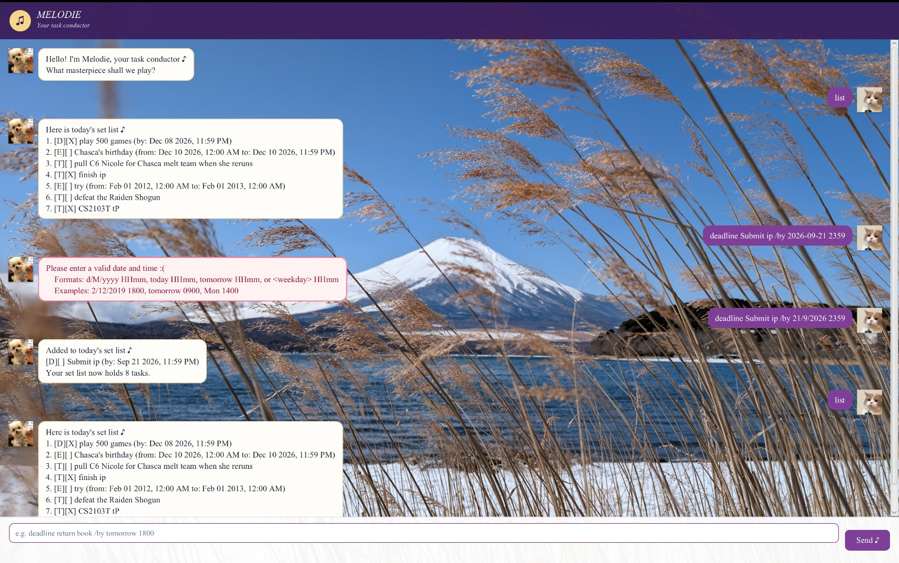

# Melodie User Guide

Melodie is a task chatbot that manages todos, deadlines, and events through
typed commands.



## Getting started

1. Ensure that Java 25 is installed.
2. Put `Melodie.jar` in the folder from which you want to run it.
3. Open a terminal in that folder.
4. Run `java -jar Melodie.jar`.
5. Type a command in the input field and press **Enter** or click **Send**.

Melodie saves your tasks automatically in `data/Melodie.txt`, relative to the
folder from which you run the application. If the file does not exist, Melodie
starts with an empty task list and creates the file when needed.

Use the **Up** and **Down** arrow keys in the input field to navigate through
commands entered during the current session.

## Command summary

| Action | Command format |
| --- | --- |
| Add a todo | `todo DESCRIPTION` |
| Add a deadline | `deadline DESCRIPTION /by DATE_TIME` |
| Add an event | `event DESCRIPTION /from DATE_TIME /to DATE_TIME` |
| List all tasks | `list` |
| Mark a task complete | `mark TASK_NUMBER` |
| Mark a task incomplete | `unmark TASK_NUMBER` |
| Find tasks | `find KEYWORD` |
| Update a task | `update TASK_NUMBER FIELD NEW_VALUE` |
| Delete a task | `delete TASK_NUMBER` |
| Exit Melodie | `bye` |

Task numbers are shown by the `list` command.

## Date and time formats

Deadlines and events accept the original numeric format as well as natural
date words. A time in 24-hour `HHmm` format is always required.

| Input | Meaning |
| --- | --- |
| `2/12/2026 1800` | 2 December 2026 at 6:00 PM |
| `today 1800` | Today at 6:00 PM |
| `tomorrow 0900` | Tomorrow at 9:00 AM |
| `Mon 1400` | The next Monday at 2:00 PM |
| `Monday 1400` | The next Monday at 2:00 PM |

Natural date words and weekday names are case-insensitive. A weekday always
means the next occurrence strictly after today. For example, `Mon` entered on
a Monday refers to the Monday of the following week.

Melodie rejects invalid calendar dates and times, such as `30/2/2026 1200` or
`2500`.

## Adding todos

Use `todo DESCRIPTION`.

Example:

```text
todo practise piano
```

## Adding deadlines

Use `deadline DESCRIPTION /by DATE_TIME`.

Examples:

```text
deadline return book /by 2/12/2026 1800
deadline submit report /by tomorrow 2359
deadline attend consultation /by Mon 1400
```

## Adding events

Use `event DESCRIPTION /from DATE_TIME /to DATE_TIME`.

Examples:

```text
event project meeting /from today 1400 /to today 1600
event workshop /from Sat 0900 /to Sat 1200
```

An event's end date and time cannot be earlier than its start date and time.

## Updating tasks

Use `update TASK_NUMBER FIELD NEW_VALUE` to change one detail without deleting
and recreating the task. Obtain the task number using `list`.

| Task type | Supported fields |
| --- | --- |
| Todo | `/description` |
| Deadline | `/description`, `/by` |
| Event | `/description`, `/from`, `/to` |

Examples:

```text
update 1 /description submit final report
update 2 /by tomorrow 2359
update 3 /from Mon 1400
update 3 /to Mon 1600
```

Each command updates one field. All other details and the task's completion
status remain unchanged. The `/by`, `/from`, and `/to` fields accept all the
date and time formats described above.

## Viewing and finding tasks

Use `list` to display every task and its task number.

```text
list
```

Use `find KEYWORD` to display tasks whose descriptions contain the keyword.
The search is case-insensitive.

```text
find report
```

## Marking tasks

Use `mark TASK_NUMBER` to mark a task as complete and `unmark TASK_NUMBER` to
mark it as incomplete again.

```text
mark 2
unmark 2
```

## Deleting tasks

Use `delete TASK_NUMBER`.

```text
delete 2
```

After deletion, run `list` again before using another task number because the
remaining tasks are renumbered.

## Exiting

Use `bye` to close Melodie safely.

```text
bye
```

## Credits

- Melodie was developed from the
  [NUS CS2103/T individual project starter repository](https://github.com/NUS-CS2103-AY2627-S1/ip).
- Cat user-avatar image: `Kitty` WhatsApp sticker pack by Zuckerschnute.
- Dog Melodie-avatar image: `guat` WhatsApp sticker pack by Viko & Co.
- Mount Fuji background: original photograph by Nathaniel Lim.

The third-party sticker artwork remains credited to its respective creators.
